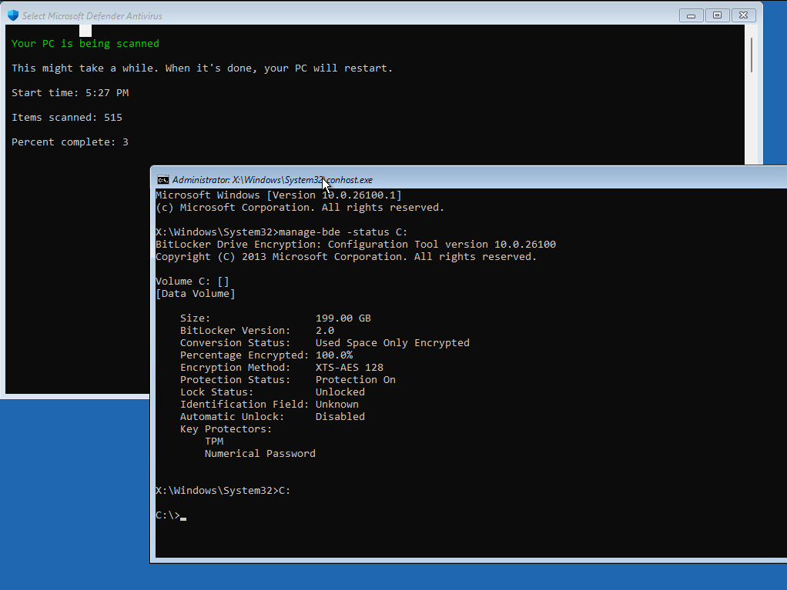

# GreatXML

GreatXML bitlocker bypass vulnerability

Steps to reproduce, 

1. If defender offline scan was initiated in the victim machine at any point then there is no need to login, the machine is automatically vulnerable. You will have to copy "unattend.xml" and "Recovery" directory to the root of the recovery partition then reboot to WinRE using shift + click on restart button, if everything was done correctly, a shell with unrestricted access to the bitlocker volume will spawn.
2. If defender offline scan was never initiated then you have to either login and initiate it yourself or figure out a way to boot into WinRE in offline scan state (I believe it should be very possible to do so without logging in) and follow steps above

If everything is done properly, this should be the result

